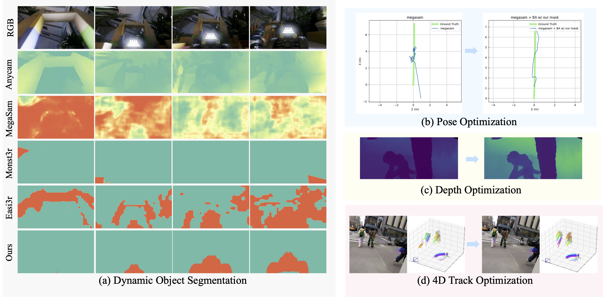

# Dynapo


This code accompanies the paper \
**The Dynamic Prior: Understanding 3D Structures for Casual Dynamic Videos**\
Zhuoyuan Wu, Xurui Yang, Jiahui Huang, Yue Wang, Jun Gao

#### News
**2025/12** We release the code and paper.\
!!!The codebase is still being sorted out and it may take some time. Please stay tuned!
#### Todos

- [x] Demo code.
- [ ] Evaluation scripts for pose optimization.
    - [ ] Guidence of more 3D reconstruction pipelines.
    - [ ] Evaluation scripts for more baselines.
- [x] Evaluation scripts for depth optimization.
- [x] Evaluation scripts for 4d track optimization.

## Dynamic Prior
The dynamic object segmentation is built on [Sa2VA](https://github.com/bytedance/Sa2VA), you can install the sa2va/demo/requirements.txt to avoid training-only packages.
```shell
cd dynamic_prior && \
conda create -n sa2va python=3.11 -y && \
conda activate sa2va && \
pip install -r demo/requirements.txt
```
### Dynamic Object Reasoning
The script supports GPT-4o, Gemini-2.5Pro, and open-sourced models like Qwen2.5-VL, Qwen3-VL, InternVL3.5, gemma. You can run the demo for dynamic object reasoning. In case you want to run GPT-4o, you need to set your openai_api_key. 
```shell
python keyframe_selector/dynamic_scene_reasoning.py \
     --scene_name walking \
     --images_dir assets/images \
     --vlm gpt4o \
     --openai_api_key your_openai_key \
     --num_samples 8 \
     --max_new_tokens 4096 \
     --output_dir ./gpt4o_outputs/
```

### Dynamic Object Segmentation
Dynamic object segmentation relies on the reasoning results. It calls Sa2VA for keyframe segmentation and propagate the object mask to the entire video. Finally we merge instance-level masks for later application.
```shell
python demo/demo_local.py assets/images \ 
    --keyframes-json ./gpt4o_outputs/walking/mllm_raw.json \
    --model_path ByteDance/Sa2VA-8B \ 
    --work-dir ./sa2va_outputs/walking
```

Feel free to swith to other MLLM backbones:
| Model Name |                             Base MLLM                             |                                 Language Part                                 |                       HF Link                        |
|:----------:|:-----------------------------------------------------------------:|:-----------------------------------------------------------------------------:|:----------------------------------------------------:|
|  Sa2VA-1B  | [InternVL2.0-1B](https://huggingface.co/OpenGVLab/InternVL2-1B) |   [Qwen2-0.5B-Instruct](https://huggingface.co/Qwen/Qwen2-0.5B-Instruct)    | [🤗 link](https://huggingface.co/ByteDance/Sa2VA-1B) |
|  Sa2VA-4B  | [InternVL2.5-4B](https://huggingface.co/OpenGVLab/InternVL2_5-4B) |    [Qwen2.5-3B-Instruct](https://huggingface.co/Qwen/Qwen2.5-3B-Instruct)     | [🤗 link](https://huggingface.co/ByteDance/Sa2VA-4B) |
|  Sa2VA-8B  | [InternVL2.5-8B](https://huggingface.co/OpenGVLab/InternVL2_5-8B) |  [internlm2_5-7b-chat](https://huggingface.co/internlm/internlm2_5-7b-chat)   | [🤗 link](https://huggingface.co/ByteDance/Sa2VA-8B) |
|  Sa2VA-26B | [InternVL2.5-26B](https://huggingface.co/OpenGVLab/InternVL2_5-26B) |  [internlm2_5-20b-chat](https://huggingface.co/internlm/internlm2_5-20b-chat)   | [🤗 link](https://huggingface.co/ByteDance/Sa2VA-26B) |

We provide our dynamic object segmentation results on [LightSpeed](https://drive.google.com/file/d/1CN6kL1iuOEM6lO1VDhRN1AxFKTtfzYZt/view?usp=sharing), [FBMS](https://drive.google.com/file/d/1fHlkCBe2T2o9oCwjiRcf2iOZuV63lZ0-/view?usp=drive_link), [SegTrackv2](https://drive.google.com/file/d/15BsfDfKzgNwdm4Pfu-pQb9RwEVLdqWB1/view?usp=drive_link), [Sintel](https://drive.google.com/file/d/1Oh3eH6ND5jw8AsvqXKOVvjm1b_9qNwAj/view?usp=sharing), [TUMRGBD](https://drive.google.com/file/d/1083HMljI1csC2avtFNd6qn0wDE7PcS22/view?usp=sharing), and [Dycheck](https://drive.google.com/file/d/132hR7SWyD3hsbS5YpElY4yA1N-LAxW2U/view?usp=sharing) for metrics evaluation and later diverse applications.

## Pose Optimization
Our pose optimization pipeline is built upon bundle adjustment in [Anycam](https://github.com/Brummi/anycam). 
### Environment Setting
```shell
cd pose_optimization && \
conda create -n anycam python=3.11 -y && \
conda activate anycam && \
pip install torch==2.5.1 torchvision==0.20.1 torchaudio==2.5.1 --index-url https://download.pytorch.org/whl/cu124 && \
conda install -c nvidia cuda-toolkit -y && \
pip install -r requirements.txt
```
### Checkpoint Downloading
```shell
./download_checkpoints.sh anycam_seq8
```

### Demo
We provide a demo script to run the pose optimization based on Anycam where Anycam predicts camera intrinsic, extrinsic and depth.
```shell
python anycam/scripts/anycam_demo.py \ 
    ++model_name=anycam \
    ++input_path=/path/to/frames \
    ++seq_name=cave_4 \
    ++model_path=pretrained_models/anycam_seq8 \
    ++ba_refinement=true \
    ++fit_video.do_ba_refinement=true \
    ++fit_video.ba_refinement_level=2 \
    ++visualize=true \
    ++rerun_mode=connect \
    ++rerun_address=localhost:9877 \
    ++fit_video.prediction.use_provided_masks=true \
    ++fit_video.prediction.mask_path=/path/to/dynamic/masks.mp4

```
### Visualization with Remote Setup
If you are developing on a remote server, you can start rerun.io as a webserver. First, open a new terminal on your remote machine and start the viewer:
```shell
# On your local machine, forward both web server and websocket ports:
ssh -L 9090:localhost:9090 -L 9877:localhost:9877 user@remote-server
```
On the remote machine:
```shell
# Kill any existing rerun processes, clear all history visualization
pkill -f "rerun"
# On remote server, start rerun in web server mode:
rerun --serve-web --bind 0.0.0.0
```
Then, forward port 9090 to your local machine. Finally, make sure to launch the script with the ++rerun_mode=connect ++rerun_address=localhost:9877. You should be able to view the results in your browser under:
```shell
http://localhost:9090/?url=ws://localhost:9877
```
### Evaluation
To evaluate the pose optimization on [LightSpeed](https://huggingface.co/datasets/nvidia/dynpose-100k), run the following command. Replace the path of ``++fit_video.prediction.mask_path`` with the dynamic masks. Note that you need to modify ``data_path_training`` and ``data_path_testing`` in ``anycam/configs/dataset_cfgs/lightspeed.yaml``
```shell
python anycam/scripts/evaluate_trajectories.py \
    -cn evaluate_trajectories \
    ++model_path=pretrained_models/anycam_seq8 \
    ++dataset=anycam/configs/dataset_cfgs/lightspeed.yaml \
    ++fit_video.dataset_type=lightspeed \
    ++fit_video.do_ba_refinement=true \
    ++fit_video.ba_refinement.max_uncert=0.5 \
    ++fit_video.ba_refinement.lr=1e-4 \
    ++fit_video.ba_refinement_level=0 \
    ++fit_video.ba_refinement.with_rerun=false \
    ++fit_video.ba_refinement.grid_size=16 \
    ++out_path=./anycam_exp/ \
    ++fit_video.prediction.use_provided_masks=true \
    ++fit_video.prediction.mask_path=path/to/lightspeed/masks
```

## Depth Optimization
Our depth optimization is build upon CVD proposed in [MegaSam](https://github.com/mega-sam/mega-sam)
### Environment Setting
```shell
cd depth_optimization && \
conda env create -f environment.yml && \
wget https://anaconda.org/xformers/xformers/0.0.22.post7/download/linux-64/xformers-0.0.22.post7-py310_cu11.8.0_pyt2.0.1.tar.bz2 && \
conda install xformers-0.0.22.post7-py310_cu11.8.0_pyt2.0.1.tar.bz2 && \
cd base; python setup.py install
```
### Checkpoint Downloading
Download [DepthAnything checkpoint](https://huggingface.co/spaces/LiheYoung/Depth-Anything/blob/main/checkpoints/depth_anything_vitl14.pth) to
    mega-sam/Depth-Anything/checkpoints/depth_anything_vitl14.pth \
Download and include [RAFT checkpoint](https://drive.google.com/drive/folders/1sWDsfuZ3Up38EUQt7-JDTT1HcGHuJgvT) at mega-sam/cvd_opt/raft-things.pth

### Evaluation
Download and unzip [Sintel data](https://drive.google.com/file/d/1J0BGtdmFlkC679C6gA9NHgWRSmeeASdU/view?usp=sharing). \
Precompute mono-depth (Please modify img-path in the script):
    `./mono_depth_scripts/run_mono-depth_sintel.sh` \
Run camera tracking (Please modify DATA_PATH in the script. Adding
    argument --opt_focal to enable focal length optimization):
    `./tools/evaluate_sintel.sh` \
Running depth optimization given estimated cameras (Please
    modify datapath and mask_path in the script): `./cvd_opt/cvd_opt_sintel_our_mask.sh` \

## 4D Track Optimization
Our 4D track optimization is based on [Stereo4D](https://github.com/Stereo4d/stereo4d-code).
### Environment Setting
```shell
cd 4D_track_optimization && \
conda env create --file=environment.yml
```

### Download the demo video
```shell
# Install gcloud sdk
curl -O https://dl.google.com/dl/cloudsdk/channels/rapid/downloads/google-cloud-cli-linux-x86_64.tar.gz
tar -xf google-cloud-cli-linux-x86_64.tar.gz
./google-cloud-sdk/install.sh
./google-cloud-sdk/bin/gcloud init
```
```shell
# To download one example
mkdir -p stereo4d_dataset/npz
gcloud storage cp gs://stereo4d/train/CMwZrkhQ0ck_130030030.npz stereo4d_dataset/npz
```
Download demo data, bash demo_run.bash, or
```shell
TIMESTAMP=66957
VIDEOID=9876543210b
VID="${VIDEOID}_${TIMESTAMP}"

echo "=== Downloading Dataset ==="
gsutil -m cp -R gs://stereo4d/demo .
mv demo stereo4d_dataset
mkdir -p stereo4d_dataset/npz stereo4d_dataset/raw
mv stereo4d_dataset/${VIDEOID}.mp4 stereo4d_dataset/raw
mv stereo4d_dataset/${VID}.npz stereo4d_dataset/npz
```
### Track optimization
```shell
# Rectify raw videos and convert to perspective projections
JAX_PLATFORMS=cpu python rectify.py \
--vid=9876543210b_66957
# Disparity from stereo matching
python inference_raft.py \
--vid=9876543210b_66957
# Dense point tracking
python tracking.py \
--vid=9876543210b_66957
# Filter Drifting tracks
python segmentation.py \
--vid=9876543210b_66957
# Track optimization
python track_optimization.py \
--vid=9876543210b_66957 \
--motion_mask_path=./stereo4d_dataset/segmentation_mask/9876543210b_66957/segmentation_mask.mp4
```